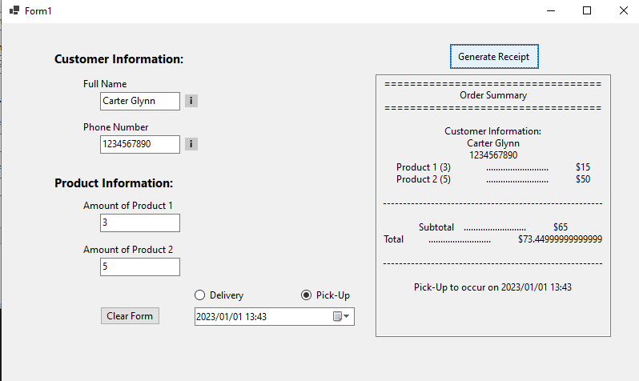

# WinForm-POS-System

## Goal  
 - Demonstrate understanding of C# classes
 - Graphical User Interface (GUI) development using visual studio
 - Event handling, data validation, and user interface design under given constraints

## Description  
Develop a GUI to be used by a sales person accepting customer orders over phone. A customer can order any quantity of one or two products to be either picked up or to be delivered to customer’s address. The following information is to be collected: 

1. Customer’s name;
2. Customer’s phone number;
3. Quantity of product 1;
4. Quantity of product 2;
5. Customer’s address, if the customer chooses the delivery option;
6. Pick up date and time, if the customer chooses the pick-up option

 
The program computes the total cost and displays a receipt. The receipt is properly formatted and must be entirely visible on the GUI (that is, the user should not have to scroll).  
It has the: 

 - customer’s name, 
 - phone number, 
 - quantities of products ordered, 
 - total cost before sales tax 
 - and the total cost including sales tax. 

 Include customer’s address on receipt only if the products are to be delivered to customer’s address. Product 1 costs $5 per item and product 2 costs $10 per item. Delivery cost is $15 per order. Sales tax is 13%.  

Perform the following data validations: 

1. Customer’s name can only have alphanumeric characters;
2. Phone number can only have exactly 10 digits;
3. Product quantity must be numeric;
4. The postal code in customer’s address is in the format LDL DLD, where L is any alphabetical character and D is any digit;
5. GUI controls to collect address are visible only when the delivery option is chosen;
6. For pickup time and date, DateTimePicker controls are used. The controls are only visible, when pickup option is selected;
7. Receipt is properly shown on the GUI and not in a separate message box;
8. Data is cleared and controls are reset for a new order;
9. Proper tab order.

In case of an error, prompt the user to re-enter data. An order can be canceled at any point before displaying the receipt. After displaying the receipt, the sales person has the option to quit or to accept the next order. Clear any data displayed on GUI prior to accepting the next order. The GUI must include the following controls: radio buttons, buttons, text boxes, date/time pickers, and labels.

